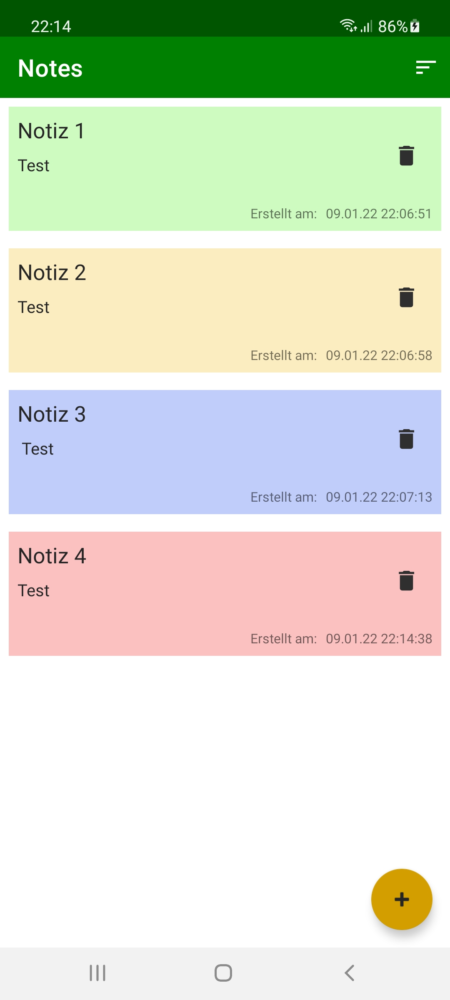

# Note App

This basic note taking app includes the following features:

- Add notes
- Edit notes
- Delete notes (with dialog for confirmation)
- Sort notes (latest first, oldest first)
- change note color

It comprises the following technical features:

- Room database
- MVVM
- Coroutines
- RecyclerView
- Confirmation Dialog  
- Splash screen animation
- Menu

